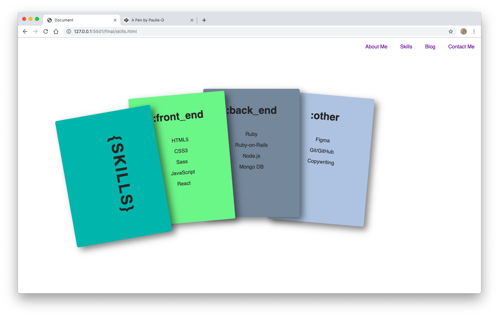

# Portfolio

My portfolio website

## Links

URL: https://www.marktomlinson.io 

GitHub: https://github.com/mark-tomlinson-dev/portfolio-website

Contributor: https://github.com/mark-tomlinson-dev

Check out my dribbble inspiration here:

https://dribbble.com/marktomlinson/buckets/1520750-portfolio

Check out my mood board here:

https://www.pinterest.com.au/markt2591/ca-portfolio/

## Description

This personal portfolio website was designed and built over the course of a week as part of the requirements for an assignment through Coder Academy's Fast Track Bootcamp. The website is stable, secure, and partly responsive. Future iterations will improve upon responsiveness, design and functionality.   

## Purpose

The purpose of this portfolio website is to provide users with a clean, clear, introduction to the author of the site. The site has been designed specifically with recruiters in mind. Through the visual design, as well as the written copy, I have tried to strike a balance between the personal and the professional. After putting together two mood boards - one on dribbble and one on pinterest - and after a great many hours of trial and error, I decided to design the site as a homage to grids and, more generlaly, to the geometric patterns grids give rise to. This seemed doubly fitting considering the site is largely built using CSS grid (in combination with flexbox). 

Colour-wise, I decided very early on to adopt a palette of soft pastels ranging through pinks, purples, and teals. Pink is at the more playful end of the spectrum, while purple and teal are meant to represent stability and trustworthiness. Pastels were also chosen to (hopefully!) match my personality: thoughtful and understated.   

Perhaps the most important design choice, however, was to let things breathe through the use of white space. Lots of white space represents room to grow as well as a calm, focused mind. It aims to let what is on the page to speak for itself - an important aspect, I believe, of any page aiming to showcase someone's personality and professional skills. 

Lastly, I have often opted to employ linear gradients to suggest movement and change. This is a static site but none of us are static beings.       
 

## Functionality/Features

I have tried to keep the number of elements and features to a minimum. My priority was to design a site that users could easily navigate and that would let the features speak for themselves. As per the requirements of the assignment, the site contains five individual pages: a home page, an about page, a skills page, a blog page, and a contact page. The home page aims to immediately establish the tone and visual language of the site by presenting users with a single graphical header component displaying my name (hey, we need to know who we're looking at here!). Its purpose is to welcome users. The skewed grid lines should draw the user's attention from the top left of the page down to the bottom right. From there, their attention should be drawn to the extremely minimal navigation menu fixed along the top right hand side of the page. 

I have chosen the about page as the next item on the navigation menu. Hopefully the home page has piqued the user's attention and they would like to know more about me. The about page is structured in a traditional two column style. On the left, there is an image of the author and on the right a brief 'about me' text. A grid has been layed on top of the image and the image has then been masked such that only certain grid squares of the image show through. A linear-gradient has then been applied to the background. The about me text has been placed into a card. Rather than sit horizontally and vertically aligned with the image, I have chosen to float the text card over the bottom right-hand portion of the image. Box-shadow has been applied to both cards in order to give the impression of depth and movement.

Particular attention has been paid to the tone and content of the 'about me' text. Rather than bore users with a cookie-cutter life story, or blandly boast about achievements, I have deliberately chosen to introduce users to my personality by composing a brief quasi-literary-styled introduction. The point is to not only grab the user's attention but to show (rather than speak directly about) my creativity. It also hopefully provides a glimpse into my background in creative writing and philosophy.

After learning a little about me, users can then click the next link in the navigation menu, which takes them to a 'skills' page. The 'skills' page has been designed expressly to demonstrate my (ahem, fledgling) technical expertise. I have divided my skills into three categories: front end, back end, and other. Each category has its own card. Each card has a title and a short list of technical skills belonging to each (e.g. HTML5, CSS3, and so on). The cards have been designed to sit a top one another in a stack. Upon hover, and using the `transform` property, the cards rotate open, neatly displaying the contents of each. Once the user hovers away from the cards container, the cards transform back to their original stacked position. `transition: .6s ease-out;` has been applied to hopefully deliver a seamless, non-stressful user experience.

The next feature on the navigation menu is the blog feature. The blog is actually a mini site within the site. It contains a 'landing page' with a header and two columns. The left column acts as a sidebar and contains an archive of previous posts as well as a 'blogroll' with links to some of my favourite blogs. The right column contains preview cards of full posts. Users can quickly browse these cards to get a preview of each post before deciding which one to click on. The 'read more' button takes users to a separate page - clean and minimally designed in order to facilitate reading - containing the full post. 

The final feature of the portfolio is a contact page. Here, users can easily get in touch with me by entering their name, email address and a message. Particular attention has been paid to the styling of the form. I wanted the form to be as inviting and minimal as possible. I removed most default graphical components to reveal the bare bones of a HTML contact form. 

## Sitemap 

## Screenshots

It took longer than expected to hit on a theme that I was happy with. The design and feel of the site went through many iterations...

It was necessary to do some wireframing...

Getting there...

And we're live!

## Target Audience

This website is primarily targetted at recruiters and people currently working in the tech industry. Hopefully, however, it might also be enjoyed by anyone with a general interest in web/software development. As mentioned above, the site has been designed specifically to lead users through a gradual introduction to the author as a fledgling full-stack developer.  

## Tech Stack

The site has been written in HTML5 and CSS3 only. While the 'about me' image was produced in figma, all other graphical components have been coded. I have used Git for version control and Netlify to deploy the site. 

